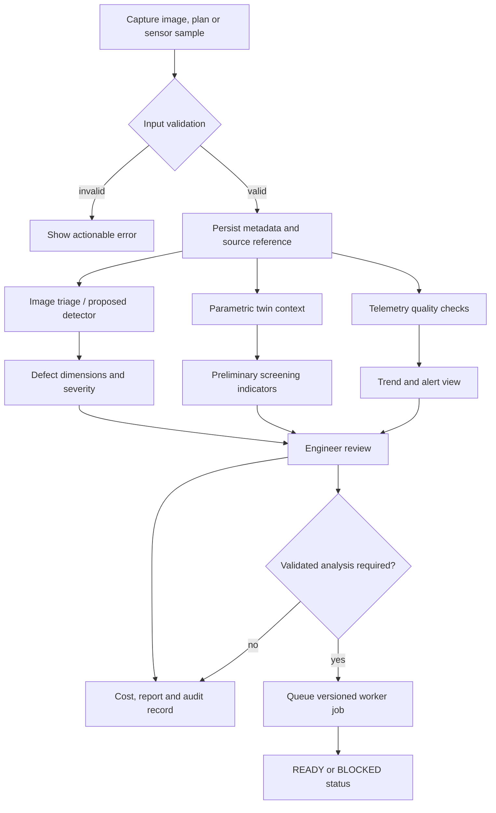
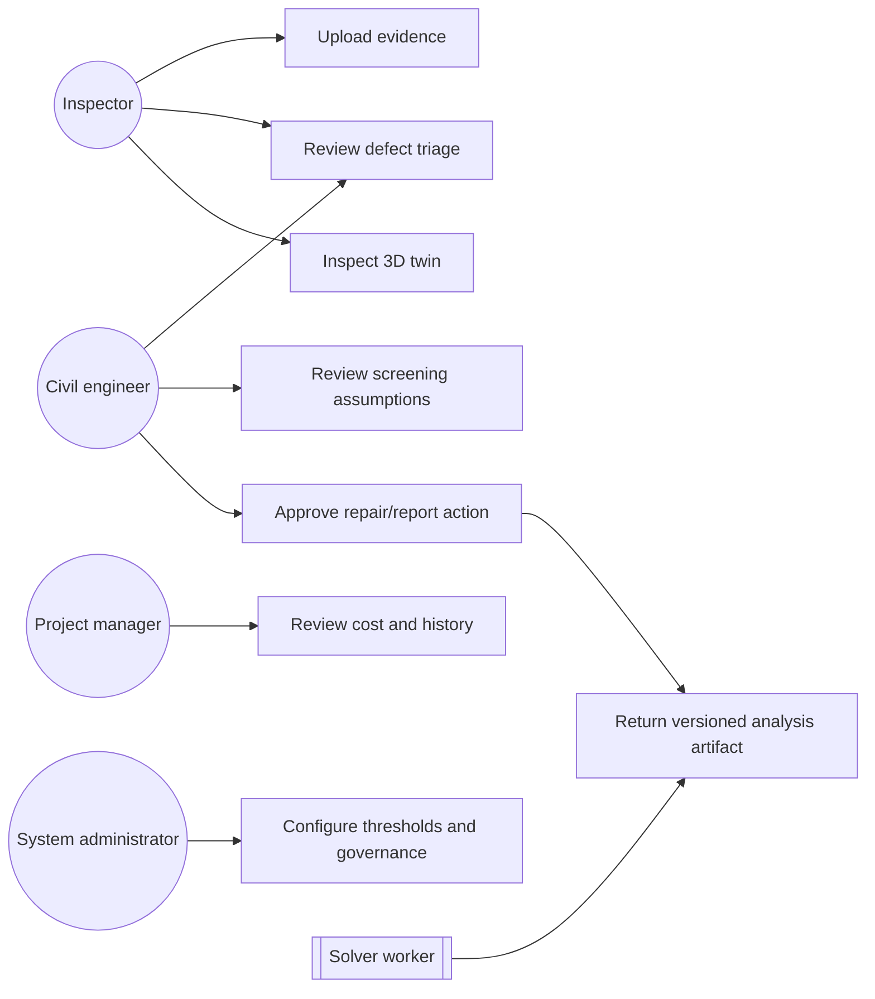

# CONSTRUCTVISION AI
## Industry-Grade Project Report

### An evidence-first civil infrastructure inspection and digital-twin prototype

**Project team**  
Ritika M. Bhumkar - ritikambhumkar@gmail.com  
Laiba Z. Mulani - laiba.mulani.ces.34@gmail.com  
Diploma Third Year Civil Engineering

**Industry Guide**  
Mr. Akash S. Chatake, M.TECH - AIML - BITS PILANI

**College Guide**  
Ms. Swati P. Maniyal, M.TECH - Structural Engineering

**Company**  
Chatake Innoworks Private Limited  
www.chatakeinnoworks.com

**Internship Division**  
MindForgeAI  
https://mindforgeai.co.in

**Document status:** Technical delivery draft  
**Date:** 21 August 2026

---

## Certificate of Approval

This is to certify that **Ritika M. Bhumkar** and **Laiba Z. Mulani**, Diploma Third Year Civil Engineering students, have prepared the project titled **“ConstructVision AI: An Evidence-First Civil Infrastructure Inspection and Digital-Twin System”** during their internship with **MindForgeAI**, the internship division of **Chatake Innoworks Private Limited**.

The work presents a Streamlit-based engineering command centre integrating image inspection, structural visualisation, telemetry concepts, preliminary mechanics, repair costing, reporting and a roadmap toward validated AI and solver services. The project has been reviewed for academic and industry documentation purposes, subject to institutional procedures and the stated technical limitations.

**College Guide signature:** ______________________________  
Ms. Swati P. Maniyal, M.TECH - Structural Engineering  
Date: ____________________

**Industry Guide signature:** _____________________________  
Mr. Akash S. Chatake, M.TECH - AIML - BITS PILANI  
Date: ____________________

**Institutional seal:** _________________________________

---

## Table of Contents

1. Chapter 1: Introduction  
2. Chapter 2: System Requirements & Feasibility  
3. Chapter 3: System Design  
4. Chapter 4: Modules & Mathematical Logic  
5. Chapter 5: Implementation & Code Structuring  
6. Chapter 6: Testing & Results  
7. Chapter 7: Conclusion & Limitations  
8. Bibliography  
9. Appendices

---

# Chapter 1: Introduction

## 1.1 Project definition

ConstructVision AI is a civil-infrastructure intelligence prototype intended to organise inspection evidence and engineering context in one interactive workspace. The project combines a Streamlit command centre, inspection image processing, parametric three-dimensional building views, demo sensor telemetry, preliminary structural screening, material knowledge, repair protocols, cost estimation and downloadable reporting workflows.

The present checkout is an evolving prototype. It does not currently contain a trained YOLOv8 inference pipeline, a production IoT gateway, a validated finite-element or CFD result, a 4D seismic solver, or an ESG carbon forecasting model. The report therefore separates implemented behaviour from proposed extensions.

## 1.2 Problem statement

Manual inspections are indispensable but often leave evidence distributed across images, paper notes, spreadsheets, drawings and verbal instructions. This fragmentation makes it difficult to answer: What was observed? Where was it observed? Which model or calibration was used? What uncertainty remains? Who reviewed the result? What action follows?

The project addresses this traceability problem by connecting inspection, asset context, screening, costing and reporting. It positions AI and automation as decision support for qualified engineers, not as a replacement for professional judgement or statutory sign-off.

## 1.3 Objectives

1. Provide an accessible civil-engineering command centre through Streamlit.
2. Process inspection images with a transparent baseline pipeline.
3. Visualise a parameterised structural frame and sensor locations.
4. Provide preliminary gravity, flexural, wind and hydrostatic screening.
5. Calculate repair material, labour, scaffolding, GST and total estimates.
6. Establish typed records for assets, captures, telemetry and analysis jobs.
7. Preserve a visible boundary between prototype results and validated solver outputs.
8. Define the implementation path for YOLOv8, seismic simulation and carbon accounting.

## 1.4 Scope

### In scope

- Streamlit pages and command-centre views.
- OpenCV image processing and crack dimension estimation.
- Three.js/Plotly structural visualisation.
- Synthetic/demo telemetry and typed telemetry contracts.
- Transparent preliminary structural equations.
- Materials, repair, costing, audit history and report workflows.
- Worker-readiness checks for future COLMAP, OpenSees and OpenFOAM services.

### Out of scope for the current prototype

- Certified defect diagnosis or structural safety approval.
- Calibrated photogrammetry and metric BIM reconstruction.
- Trained YOLOv8 accuracy claims.
- Nonlinear seismic response or validated 4D simulation.
- ESG inventory data and carbon forecast validation.
- Production MQTT ingestion, authentication, RBAC and immutable object storage.

---

# Chapter 2: System Requirements & Feasibility

## 2.1 Functional requirements

| ID | Requirement | Current status |
| --- | --- | --- |
| FR-01 | Upload an inspection image | Implemented |
| FR-02 | Estimate crack dimensions from a calibration ratio | Implemented baseline |
| FR-03 | Display structural defects and severity | Implemented rule-based |
| FR-04 | View parametric building geometry | Implemented |
| FR-05 | Display sensor nodes and demo telemetry | Implemented/demo |
| FR-06 | Run transparent screening calculations | Implemented in `modules/digital_twin/engine.py` |
| FR-07 | Estimate repair cost and GST | Implemented in `pages/8_💰_Cost_Estimation.py` |
| FR-08 | Maintain inspection history and export data | Implemented prototype |
| FR-09 | Validate asset/capture/telemetry/job contracts | Implemented in `platform_core/contracts.py` |
| FR-10 | Dispatch validated reconstruction/FEA/CFD jobs | Contract/readiness boundary only |
| FR-11 | YOLOv8, ESG and seismic analysis | Proposed extension |

## 2.2 Hardware requirements

### Development

- Dual-core or better CPU; 8 GB RAM minimum, 16 GB recommended.
- 5 GB free storage for Python environment, assets and models.
- 1080p display and modern Chromium/Firefox browser.
- Optional NVIDIA GPU for future object-detection training/inference.

### Field deployment target

- Smartphone, calibrated camera, drone or site camera.
- Edge gateway for sensor aggregation.
- Strain, tilt, acceleration, temperature, humidity, water-level and wind sensors.
- Secure network with MQTT over TLS or an equivalent authenticated protocol.

## 2.3 Software requirements

- Python 3.10+ recommended.
- Streamlit, NumPy, Pandas, Pillow, OpenCV, Plotly and Folium as listed in `requirements.txt`.
- Optional future stack: Ultralytics/PyTorch, PostgreSQL/TimescaleDB, MQTT client, COLMAP, OpenSees and OpenFOAM.
- Markdown preview, Mermaid rendering, HTML Live Server and PDF viewer for documentation.

## 2.4 Feasibility

### Technical feasibility

The prototype is technically feasible because the core user experience runs in Python and Streamlit, with web-native visualisation embedded where required. Production feasibility depends on calibrated data, secure persistence, background jobs and solver validation.

### Operational feasibility

The workflow is suitable for inspection triage, evidence organisation and education. Safety-critical decisions require qualified engineer review, traceable assumptions and applicable codes.

### Economic feasibility

The current prototype is low-cost to run locally. Production cost will be driven by GPU inference, object storage, sensor connectivity, model retraining, solver workers, security controls and professional validation.

### Legal and ethical feasibility

Images may include workers, private sites and sensitive infrastructure. Consent, access control, retention, data minimisation and human accountability must be implemented before operational deployment.

---

# Chapter 3: System Design

## 3.1 High-level architecture

```text
User / Inspector
       |
       v
Streamlit command centre
  |       |        |        |
  v       v        v        v
Image   Twin     Telemetry Cost/report
triage  viewer   contracts  workflows
  |       |        |        |
  +-------+--------+--------+
              |
              v
     Evidence and review layer
              |
       Future worker queue
       /        |         \
   COLMAP    OpenSees    OpenFOAM
```

## 3.2 Workflow diagram



## 3.3 Use-case diagram



## 3.4 Data-flow and governance principles

Every future result should retain source URI, timestamp, calibration, model revision, unit, quality flag, assumptions, reviewer and status. A blocked external solver must remain blocked. A preliminary result must carry a visible warning. A forecast must retain the factor version and uncertainty interval.

---

# Chapter 4: Modules & Mathematical Logic

## 4.1 Module 1 - Home and command centre

The root `app.py` provides portfolio and operational views including command centre, twin studio, capture and reconstruction, asset health and integration. It is the main narrative and navigation layer.

## 4.2 Module 2 - Tutorial and virtual practical learning

The tutorial explains manual versus AI-assisted workflows, structural materials, safety practice, damage types and reporting. The virtual practical module presents construction activities, material requirements and safety protocols. These modules support training and explainability.

## 4.3 Module 3 - Structural digital twin

`pages/3_🏗️_3D_Building.py` accepts plans and site photos, estimates plan extents from contours, exposes building width/depth/floor/story parameters and renders an interactive Three.js scene. It includes render modes, component highlighting, camera presets, rebar visibility and labelled behaviours: static, wind, seismic and settlement. The seismic label is currently a visual scenario selector, not a validated seismic solver.

## 4.4 Module 4 - Materials library

The materials pages present concrete, cement, steel, brick, sand, tiles and paint information using local assets. This gives inspection results practical context for repair planning.

## 4.5 Module 5 - AI inspection and crack triage

The current pipeline is OpenCV-based. For contour $c$ with area $A_c$ and bounding rectangle $(w,h)$, the code keeps the contour when:

$$A_c>20.$$

With scale $s$ in mm/px:

$$L=s\max(w,h),\qquad W=s\min(w,h).$$

Severity is `SAFE` for $W\leq1$ mm, `WARNING` for $1<W\leq2$ mm and `CRITICAL` for $W>2$ mm. The confidence-like number is a heuristic display metric and must not be called a calibrated AI confidence.

### Proposed YOLOv8 logic

For a future trained detector:

$$\mathcal L=\lambda_{box}\mathcal L_{CIoU}+\lambda_{cls}\mathcal L_{BCE}+\lambda_{dfl}\mathcal L_{DFL}.$$

The evaluation must include class-wise precision, recall, mAP@0.5, mAP@0.5:0.95, confusion matrix, false-negative examples and calibration error.

## 4.6 Module 6 - Damage analysis and repair recommendation

The damage analysis page provides structured records for hairline cracks, corrosion, leakage, spalling and honeycombing, with severity, repair material, estimated cost and recommended procedures. Human review is necessary before a repair action becomes a project instruction.

## 4.7 Module 7 - 3D/IoT sensor nodes

The 3D page defines demo sensors for settlement, strain and vibration and associates them with structural components and coordinates. `modules/digital_twin/engine.py` also generates 168 hours of synthetic telemetry with a fixed seed. The platform contracts permit strain, tilt, acceleration, displacement, temperature, humidity, water level and wind speed, plus `GOOD`, `SUSPECT` and `BAD` quality values.

## 4.8 Module 8 - Cost estimation

In `pages/8_💰_Cost_Estimation.py`, each defect type maps to a rate and coverage factor. The equations are:

$$Q=\frac{A}{C},\qquad C_m=A\,r,$$

$$C_s=A\times80\times u,\qquad C_b=C_m+C_l+C_s,$$

$$C_{GST}=C_b\frac{g}{100},\qquad C_{total}=C_b+C_{GST}.$$

Here $A$ is area in square feet, $C$ coverage per unit, $r$ the material rate, $u\in\{1.0,1.2,1.5\}$ the standard/high/emergency urgency multiplier, $C_l=₹5625$ fixed labour and $g$ the selected GST percentage. The editable BOQ recalculates totals from user-edited rows.

## 4.9 Module 9 - Report generator and audit history

The report page combines project metadata, inspection evidence, detection summary, damage metrics, repair materials, steps, costs and history. The history page filters sample records by date, severity, status and inspection type and exports CSV/JSON-style records.

## 4.10 Module 10 - Safety AI and governance

Settings exposes confidence thresholds, crack sensitivity, automatic critical-defect flags, PPE engine labels, unsafe-zone dwell time, heat-stress screening, MQTT endpoint settings, alert channels, ISO 19650 governance mode and retention choices. These controls are primarily interface configuration in the current prototype.

## 4.11 Module 11 - NLP logs and evidence records

The project includes structured history and report text, but no production NLP model is wired into the checkout. A future NLP layer can extract component, defect, location, date, severity, cause and action from notes while retaining the original text and reviewer confirmation.

## 4.12 Module 12 - Thermal IR and environmental monitoring

Thermal heat-stress screening is exposed as a settings option and temperature is part of synthetic telemetry. A thermal-IR defect detector is not implemented. A future module should distinguish surface temperature, ambient conditions, emissivity, calibration and inferred moisture or delamination.

## 4.13 Module 13 - Worker orchestration and digital-twin services

`platform_core/contracts.py` defines `AssetCreate`, `CaptureCreate`, `TelemetrySample`, `TelemetryBatch` and `AnalysisRequest`. `workers/dispatcher.py` checks COLMAP, OpenSees and OpenFOAM availability. Supported analysis states are explicit: `READY` when the executable is available and `BLOCKED` otherwise.

### Seismic energy release equation for a future module

For a magnitude $M$ event, an empirical radiated-energy approximation is:

$$\log_{10}E_J=1.5M+4.8,$$

so:

$$E_J=10^{1.5M+4.8},\qquad E_{TNT}=\frac{E_J}{4.184\times10^9}\;\text{tonnes TNT}.$$

This conversion is for scenario communication; structural demand still requires ground motion, site conditions, model properties and code procedures.

### Euclidean safety proximity equation for a future module

For worker position $\mathbf p=(x_p,y_p,z_p)$ and hazard or equipment position $\mathbf h=(x_h,y_h,z_h)$:

$$d(\mathbf p,\mathbf h)=\sqrt{(x_p-x_h)^2+(y_p-y_h)^2+(z_p-z_h)^2}.$$

An alert can be issued if $d<d_{safe}$ for a defined dwell time, with sensor uncertainty and zone geometry included in a production implementation.

---

# Chapter 5: Implementation & Code Structuring

## 5.1 Repository structure

```text
app.py                         Root Streamlit experience
pages/                         Prototype multipage modules
modules/digital_twin/engine.py Transparent screening and telemetry
platform_core/contracts.py     Pydantic domain contracts
workers/dispatcher.py          External solver readiness
assets/                        Images, models and 3D assets
data/ and database/             Local reference data
tests/                         Test location for future expansion
documentation_workspace/       This publication package
```

## 5.2 Implementation approach

The prototype follows a progressive architecture: start with a usable interface, preserve transparent calculations, expose integration boundaries, and add validated workers only when their dependencies and test cases exist. Streamlit is appropriate for rapid demonstration; production deployment should separate the presentation layer from API, persistence, queues and solver workers.

## 5.3 Recommended production structure

```text
capture service -> object storage -> metadata API -> event queue
                                      |                  |
                                      v                  v
                              PostgreSQL/TimescaleDB   workers
                                      |                  |
                                      +------> audit artifacts
```

Recommended controls include OIDC/RBAC, TLS, secrets management, schema validation, UTC timestamps, immutable source manifests, model registry, signed report versions, structured logs, backups and retention policies.

---

# Chapter 6: Testing & Results

## 6.1 Test strategy

| Test layer | Test objective | Evidence to attach |
| --- | --- | --- |
| Unit | Validate equations and boundary thresholds | Automated test output |
| Image pipeline | Check contour filtering and scale conversion | Annotated image set |
| UI | Confirm upload, controls, export and responsive layout | Screenshots/video |
| Contract | Reject invalid URIs, units and telemetry fields | API validation log |
| Integration | Check worker readiness states | Worker status log |
| Performance | Measure inference, render, query and export latency | Benchmark table |
| Engineering | Compare screening/solver outputs with references | Independent review |

## 6.2 Current results

The current source supports a working prototype interface with transparent rule-based inspection, parameterised geometry, synthetic telemetry, cost calculations and configuration views. It does not support publication of detector accuracy, seismic accuracy, carbon forecast accuracy or solver performance.

## 6.3 Evidence placeholders

- `[Insert screenshot of Home / Command Centre here]`
- `[Insert screenshot of AI Inspection Module here]`
- `[Insert Screenshot of 4D Seismic Module Here]`
- `[Insert screenshot of Structural Digital Twin here]`
- `[Insert screenshot of IoT sensor dashboard here]`
- `[Insert screenshot of Cost Estimation and BOQ here]`
- `[Insert screenshot of Report Generator here]`
- `[Insert screenshot of Solver BLOCKED/READY status here]`
- `[Insert benchmark table with dataset name, split, hardware and seed here]`
- `[Insert signed engineer review record here]`

## 6.4 Required future metrics

For vision: precision, recall, F1, mAP, per-class false negatives, calibration error and latency. For crack measurement: MAE/RMSE in mm and scale sensitivity. For seismic analysis: modal frequencies, drift error, energy balance, time-step convergence and comparison with a reference solver. For ESG: inventory completeness, factor traceability, forecast MAE/MAPE and interval coverage. For usability: task completion rate, time-on-task and reviewer agreement.

## 6.5 Results interpretation rule

Any number shown in a dashboard, tutorial, sample record or simulated stream must be labelled as demonstrative unless it is linked to a reproducible test, dataset, code revision, hardware configuration and review record.

---

# Chapter 7: Conclusion & Limitations

ConstructVision AI provides a coherent foundation for evidence-first infrastructure inspection. It links images, geometry, telemetry concepts, transparent mechanics, repair costing and reporting in a single Streamlit experience. The strongest engineering value is not an unsupported claim of automation; it is the visible relationship between assumptions, results, status and human review.

The main limitations are the absence of a trained YOLOv8 pipeline, real field calibration, labelled data, production database, production sensor gateway, validated seismic solver, ESG emission factors and empirical benchmarks. The OpenCV baseline is sensitive to lighting, texture, camera position and threshold selection. The structural equations are screening approximations. The synthetic telemetry is not evidence of a physical asset. The cost database is illustrative and must be tied to current local rates, quantity take-offs, taxes and contract terms.

The next release should prioritise data governance and repeatable validation: labelled inspections, calibrated capture procedures, model versioning, uncertainty reporting, independent civil-engineering review, secure APIs, real telemetry and solver-backed analysis. Only after these gates are passed should the system be presented as a decision-grade digital twin.

---

# Bibliography

1. Sacks, R. et al. “Construction with digital twin information systems.” *Data-Centric Engineering*, 1, e14, 2020.
2. Boje, C. et al. “Towards a semantic construction digital twin.” *Automation in Construction*, 114, 103179, 2020.
3. Liu, Y. et al. “Transforming data into decision making: A spotlight review of construction digital twin.” *Buildings*, 11(12), 598, 2021.
4. Opoku, M. et al. “Digital twin and its applications in the construction industry: A state-of-art systematic review.” *Digital Twin*, 2, 2024.
5. Dorafshan, S., Thomas, R. J., and Maguire, M. “Comparison of deep convolutional neural networks and edge detectors for image-based crack detection in concrete.” *Construction and Building Materials*, 186, 1031-1045, 2018.
6. Elhariri, A. et al. “Computer vision framework for crack detection of civil infrastructure - A review.” *Journal of Building Engineering*, 67, 105979, 2023.
7. Farrar, C. R. and Worden, K. *Structural Health Monitoring: A Machine Learning Perspective*. Wiley, 2012.
8. Jocher, G., Chaurasia, A., and Qiu, J. *Ultralytics YOLO*. Ultralytics, 2023.
9. Chopra, A. *Dynamics of Structures: Theory and Applications to Earthquake Engineering*, 5th ed. Pearson, 2017.
10. FEMA. *NEHRP Recommended Seismic Provisions for New Buildings and Other Structures*, FEMA P-1050, 2020.
11. GHG Protocol. *A Corporate Accounting and Reporting Standard*, revised ed., WRI/WBCSD, 2004.
12. ISO 14064-1:2018. *Greenhouse gases - Part 1: Specification with guidance at the organization level*, ISO, 2018.
13. He, K. et al. “Deep residual learning for image recognition.” *Proc. IEEE CVPR*, 2016.
14. Redmon, J. et al. “You only look once: Unified, real-time object detection.” *Proc. IEEE CVPR*, 2016.
15. ISO 19650-1:2018. *Organization and digitization of information about buildings and civil engineering works*, ISO, 2018.
16. Ultralytics. “Ultralytics documentation.” https://docs.ultralytics.com/
17. Streamlit. “Streamlit documentation.” https://docs.streamlit.io/
18. OpenSees. “OpenSees documentation.” https://opensees.berkeley.edu/

---

# Appendix A: Branding and contact metadata

**Project team:** Ritika M. Bhumkar (ritikambhumkar@gmail.com); Laiba Z. Mulani (laiba.mulani.ces.34@gmail.com)  
**Industry Guide:** Mr. Akash S. Chatake, M.TECH - AIML - BITS PILANI  
**College Guide:** Ms. Swati P. Maniyal, M.TECH - Structural Engineering  
**Chatake Innoworks Private Limited:** www.chatakeinnoworks.com  
**MindForgeAI:** https://mindforgeai.co.in

# Appendix B: Local execution

```powershell
.\.venv\Scripts\python.exe -m streamlit run app.py --server.address 127.0.0.1 --server.port 8501
```

The active prototype entry point is `app.py`; the repository also contains legacy/evolving modules under `pages/`.
